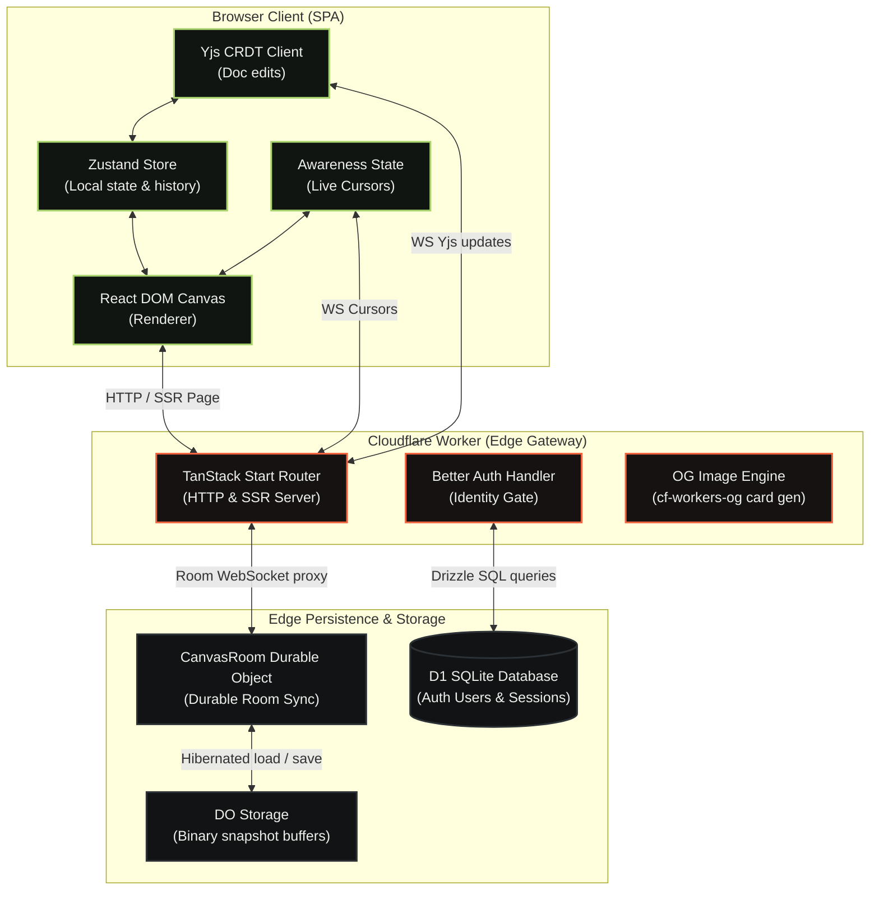

# Zigma

Zigma is an infinite canvas for designing live HTML and React interfaces. It combines a DOM-first renderer, nested layers, a property inspector, undo/redo, and Yjs-based multiplayer rooms persisted by Cloudflare Durable Objects.

## Architecture



_(A styled vector version of this diagram is also available at [public/architecture.svg](public/architecture.svg).)_

## What is included

- TanStack Start + React 19 + Vite 8
- Cloudflare Workers deployment through the official Vite plugin
- Infinite pan/zoom canvas with grid snapping
- Nested frames and live DOM design primitives
- Layers, visibility, locking, ordering, multi-select, duplicate, and delete
- Selection-aware right-click menus with bulk hierarchy and layer actions
- Transform, appearance, content, and typography inspection
- Selected-frame and multi-frame export to PNG, JPEG, SVG, ZIP, and PDF
- Gesture-aware undo/redo history
- Yjs collaborative document synchronization
- Live cursors and selections through Yjs awareness
- Durable Object snapshots with hibernating PartyServer WebSockets
- Better Auth guest identities and Google account upgrades
- Drizzle-managed Cloudflare D1 users, sessions, OAuth accounts, and rate limits
- Authenticated realtime rooms with named collaborator cursors
- Responsive product landing page and `/studio/$documentId` rooms
- Edge-rendered Open Graph images and complete Twitter card metadata
- Unit tests for geometry, history, hierarchy, and Yjs serialization

## Renderer choice

The editor uses the browser DOM as its scene renderer. The product is intended to edit React and HTML, so native layout, typography, accessibility, and content editing are more valuable than rasterizing every node into Canvas 2D or WebGL. GPU-backed rendering can still be added later for effects, previews, or extremely dense primitive layers without changing the document model.

The experimental HTML-in-Canvas API is deliberately not required. It is useful as a future acceleration path, but it is not yet a safe cross-browser foundation.

## Local development

```bash
bun install
bun run cf-typegen
bun run db:migrate:local
bun run dev
```

Open `http://localhost:3000` for the landing page or `http://localhost:3000/studio/demo` for the editor.

The Cloudflare Vite plugin runs the Worker and Durable Object locally, so opening the same room in two browser windows exercises real collaboration.

Local auth reads `.dev.vars`. Copy `.dev.vars.example` if needed and use a
development-only Better Auth secret. Google sign-in is optional locally; when
its credentials are absent, guest username sign-in remains fully functional.

## Validation

```bash
bun run validate
```

The validation pipeline runs formatting checks, ESLint, Vitest, TypeScript, and the production build. Individual commands are also available:

```bash
bun run check
bun run lint
bun run test
bun run typecheck
bun run db:check
bun run build
```

## Cloudflare deployment

Authenticate once, then deploy:

```bash
export CLOUDFLARE_ACCOUNT_ID=your_account_id
bunx wrangler login
# First deployment only; skip when AUTH_DB is already configured:
bun run db:create
bun run cf-typegen
bun run db:migrate:remote
bunx wrangler secret put BETTER_AUTH_SECRET
bunx wrangler secret put GOOGLE_CLIENT_ID
bunx wrangler secret put GOOGLE_CLIENT_SECRET
bun run deploy
```

Keep `CLOUDFLARE_ACCOUNT_ID` in your shell or CI environment rather than the
tracked OSS configuration. `db:create` creates `canvas-pro-auth` in that account
and updates the `AUTH_DB` binding; subsequent deploys should only apply pending
migrations. Generate the production Better Auth secret with
`openssl rand -base64 32`.

In Google Cloud Console, register these authorized redirect URIs:

```text
http://localhost:3000/api/auth/callback/google
https://YOUR_DOMAIN/api/auth/callback/google
```

The current origin is used dynamically, so Workers preview and custom domains
can each have their own registered redirect URI without changing application
code.

`wrangler.jsonc` includes:

- the custom TanStack Start Worker entrypoint at `src/server.ts`
- the `zigma-canvas-pro` Worker name
- a `CanvasRoom` Durable Object binding
- an `AUTH_DB` Cloudflare D1 binding
- a SQLite-backed Durable Object migration
- Worker observability

After changing bindings, regenerate types:

```bash
bun run cf-typegen
```

The deployment health endpoint is `/api/health`.

Social previews are rendered as 1200×630 PNGs at `/api/og`. The landing page
and studio routes emit absolute Open Graph, Twitter card, and canonical metadata
using the current request origin, so previews work on local, preview, and custom
Cloudflare domains without a hard-coded production URL.

## Canvas export

The editor header exports the selected frame (including when a child layer is
selected) or every visible top-level frame. PNG, JPEG, and PDF support 1×, 2×,
or 3× rendering. Multi-frame image and SVG exports are packaged as a ZIP; PDF
uses one correctly sized page per frame. Exported assets embed the project fonts
and omit editor-only selection controls, labels, resize handles, and collaborator
cursors.

## Collaboration architecture

Each URL room (`/studio/:documentId`) maps to one `CanvasRoom` Durable Object. The browser stores nodes as nested Yjs maps, with individual node and style fields represented as shared values. This avoids whole-document last-write-wins behavior when collaborators edit different properties.

The server periodically persists a compact Yjs state update into Durable Object storage and restores it after eviction. Awareness state carries cursors and selections but is intentionally ephemeral.

Better Auth stores user, session, provider account, verification, and rate-limit
records in D1. Anonymous users choose a display name before entering. Their
authenticated identity is broadcast through Yjs awareness, producing stable
avatar colors and named cursors. Signing in with Google upgrades the anonymous
session; OAuth tokens are encrypted before D1 storage.

## Production notes

The current room model is intentionally link-accessible to signed-in users.
WebSocket upgrades require a valid Better Auth session and a same-origin
request, but anyone who is authenticated and has the room link can collaborate.
Before using private customer documents, add explicit owner/member permissions;
do not treat unguessable room IDs as authorization.

For larger scenes, the next performance step is viewport culling of offscreen DOM nodes. The current renderer keeps the implementation clear and fully interactive for the included product-scale document.
